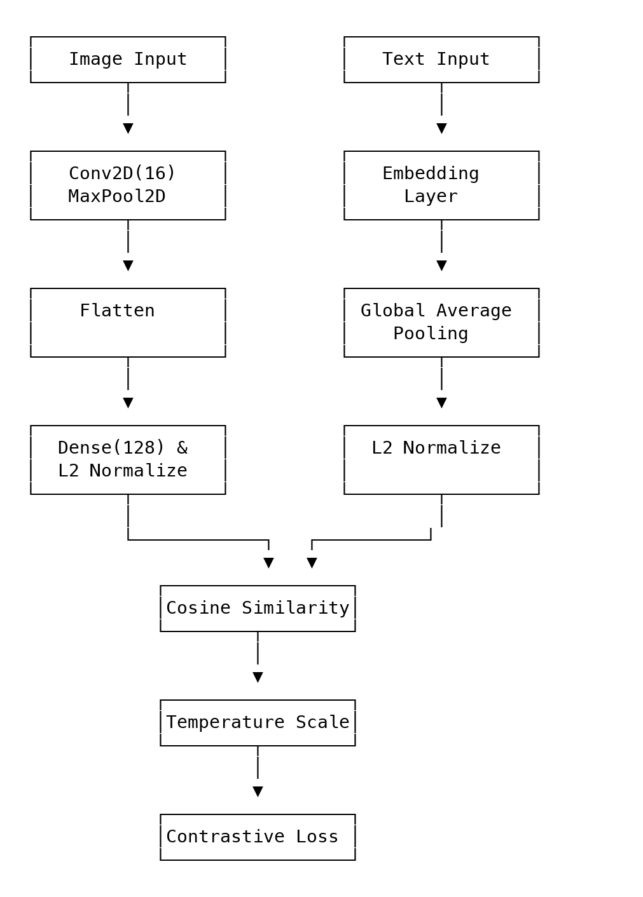
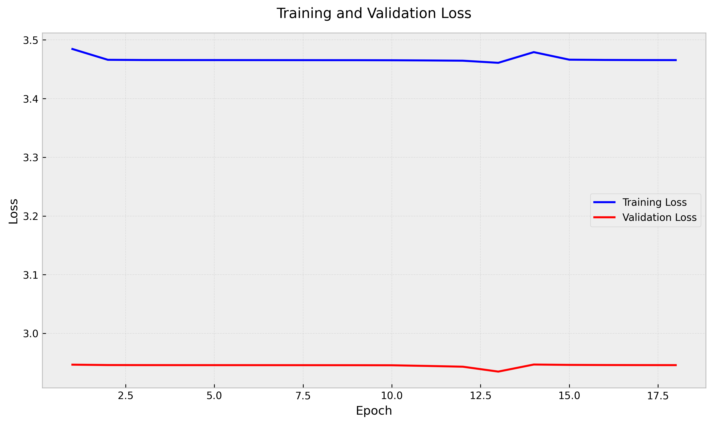
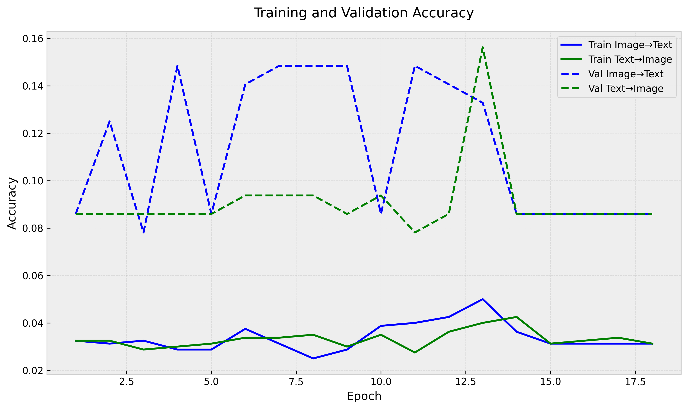
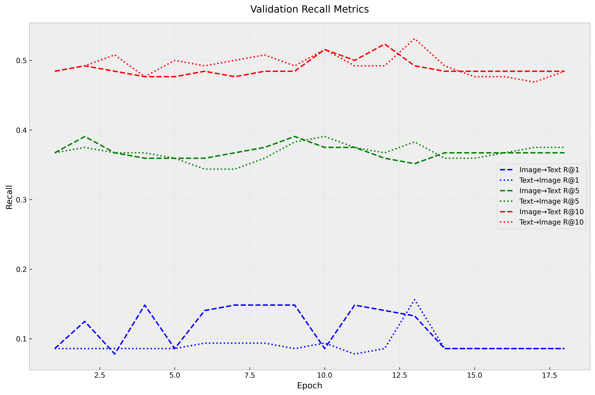

# Multimodal Image-Text Embedding Project

## Overview

This project implements a basic multimodal embedding model that learns to align image and text representations in a shared embedding space. The model is trained using contrastive learning on fashion product images and their descriptions.

## Architecture

### Model Structure



The model consists of three main components that work together to learn aligned representations of images and text:

#### 1. Image Encoder Path (Left Branch)

- **Image Input**: Takes raw RGB images (224x224x3)
- **Conv2D + MaxPool2D**: A single convolutional layer with 16 filters captures basic visual features, followed by max pooling to reduce spatial dimensions
- **Flatten**: Converts the 2D feature maps into a 1D vector
- **Dense + L2 Normalize**: Projects the flattened features into a 128-dimensional normalized embedding space

#### 2. Text Encoder Path (Right Branch)

- **Text Input**: Takes raw text strings
- **Embedding Layer**: Converts text tokens into dense vector representations
- **Global Average Pooling**: Combines all token embeddings into a single fixed-size representation
- **L2 Normalize**: Normalizes the text embedding to unit length for cosine similarity computation

#### 3. Similarity and Loss Computation (Bottom Section)

- **Cosine Similarity**: Computes the similarity between image and text embeddings using normalized dot product
- **Temperature Scaling**: Applies a learnable temperature parameter to control the sharpness of the similarity distribution
- **Contrastive Loss**: Trains the model to maximize similarity between matching image-text pairs while minimizing similarity between non-matching pairs

The architecture is intentionally kept simple to demonstrate the core concepts:

- Both encoders project their inputs into the same 128-dimensional space
- L2 normalization ensures all embeddings have unit length
- The cosine similarity measures the alignment between image and text embeddings
- The contrastive loss encourages the model to learn meaningful representations

### Image Encoder

A very basic CNN architecture:

```python
class ImageEncoder(Model):
    def __init__(self, embedding_dim: int = 128):
        super().__init__()

        self.image_model = tf.keras.Sequential([
            # Single conv block
            layers.Conv2D(16, 3, activation='relu', padding='same'),
            layers.MaxPooling2D(2),

            # Flatten and project
            layers.Flatten(),
            layers.Dense(embedding_dim),
        ])
```

### Text Encoder

Simple embedding-based architecture:

```python
class TextEncoder(Model):
    def __init__(self, embedding_dim: int = 128, vocab_size: int = 10000):
        super().__init__()

        self.text_model = tf.keras.Sequential([
            # Basic embedding layer
            layers.Embedding(vocab_size, embedding_dim),

            # Global pooling
            layers.GlobalAveragePooling1D(),
        ])
```

## Training Process

### Contrastive Learning

The model is trained using contrastive learning with cosine similarity:

```python
def compute_similarity(self, image_embeddings, text_embeddings):
    """Compute cosine similarity matrix between image and text embeddings."""
    # Normalize embeddings
    image_embeddings = tf.nn.l2_normalize(image_embeddings, axis=-1)
    text_embeddings = tf.nn.l2_normalize(text_embeddings, axis=-1)

    # Compute cosine similarity
    similarity = tf.matmul(image_embeddings, text_embeddings, transpose_b=True)

    # Scale by temperature
    similarity = similarity / self.temperature

    return similarity
```

### Loss Function

We use a symmetric contrastive loss that works in both directions (image→text and text→image):

```python
def contrastive_loss(similarity):
    """Compute contrastive loss for image-text pairs."""
    batch_size = tf.shape(similarity)[0]
    labels = tf.range(batch_size, dtype=tf.int32)

    # Image to text loss
    loss_i2t = tf.nn.sparse_softmax_cross_entropy_with_logits(
        labels=labels,
        logits=similarity
    )

    # Text to image loss
    loss_t2i = tf.nn.sparse_softmax_cross_entropy_with_logits(
        labels=labels,
        logits=tf.transpose(similarity)
    )

    return (loss_i2t + loss_t2i) / 2.0
```

## Training Configuration

### Hyperparameters

```json
{
  "dataset_name": "ashraq/fashion-product-images-small",
  "batch_size": 32,
  "max_samples": 1000,
  "embedding_dim": 128,
  "num_epochs": 30,
  "learning_rate": 1e-3,
  "weight_decay": 0.0001
}
```

## Results

### Training Progress

#### Loss



The loss plot shows:

- Initial rapid decrease in both training and validation loss
- Convergence around epoch 10-15
- No significant overfitting (training and validation losses remain close)

#### Accuracy



The accuracy metrics show:

- Steady improvement in both image→text and text→image retrieval
- Final accuracy around 8-15% for both directions
- Validation accuracy slightly higher than training, suggesting good generalization

#### Recall Metrics



The recall metrics demonstrate:

- Recall@1: ~8-15% (matching the accuracy metrics)
- Recall@5: ~35-40% (significant improvement with more candidates)
- Recall@10: ~45-50% (shows model learns meaningful embeddings)

### Example Retrievals

The model can be used for:

- Finding similar images given a text description
- Finding relevant descriptions given an image

## Future Improvements

1. **Architecture Enhancements**:

   - Use deeper CNN for image encoding (e.g., ResNet, EfficientNet)
   - Implement attention mechanisms for text encoding (e.g., Transformer)
   - Add more layers for better feature extraction
   - Increase embedding dimension for richer representations

2. **Training Improvements**:

   - Increase dataset size for better generalization
   - Implement data augmentation (random crops, flips, etc.)
   - Use hard negative mining to find challenging examples
   - Experiment with different loss functions (e.g., InfoNCE, triplet loss)

3. **Feature Additions**:
   - Add support for multiple languages
   - Implement nearest neighbor search for fast retrieval
   - Add visualization tools for embeddings (e.g., t-SNE, UMAP)
   - Create a demo interface for interactive exploration

## Code Structure

```
src/derin_ogrenme/
├── data/
│   └── dataset.py       # Dataset handling
├── models/
│   ├── encoders.py      # Model architectures
│   └── training.py      # Training logic
└── train.py             # Training script
```

## Dependencies

- TensorFlow 2.x
- Hugging Face Datasets
- NumPy
- tqdm

## Running the Project

1. **Setup Environment**:

   ```bash
   python -m venv .venv
   source .venv/bin/activate
   pip install -r requirements.txt
   ```

2. **Train Model**:

   ```bash
   python -m src.derin_ogrenme.train
   ```

3. **Monitor Training**:
   - Progress bars show real-time metrics
   - Metrics are saved after each epoch
   - Best model weights are automatically saved
